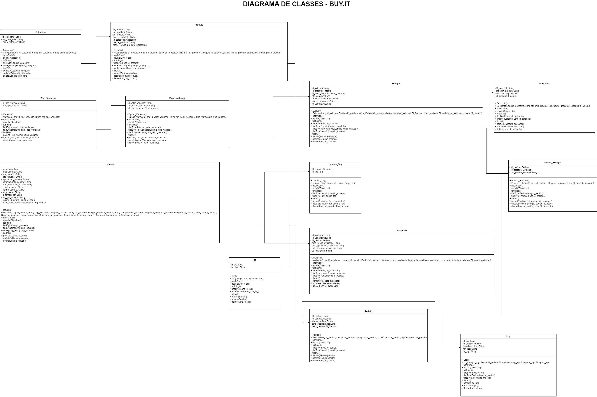

# **Challenge 2023 - FIAP & Level Group BR & BUY.it**
<br />
<p align="center">
  
</p>

<p align="center">
  <a href="https://www.youtube.com/watch?v=Np47f6JyktY" style="text-align: center; display: block;">Assista no Youtube!!</a>
</p>

<br />

**Grupo:**
- Gustavo Sanches - RM 97068 - Back End & Banco de Dados (Scrum Master)
- Kaue Caponero - RM 96466 - Back End & IA
- Mariana Santos - RM 97503 - Front End & Web Design
- Natan Cruz - RM 97324 - QA & DevOps 
- Vitor Rubim - RM 97092 - Front End & QA

<hr/>

[Protótipo (FIGMA)](https://www.figma.com/file/ugcDozQL0YCSZWAIhKNiP9/Challenge-2?type=design&mode=design&t=EbrQiTt09tx8rjLI-0)

<details>
<summary><h3><u>Escopo do Produto</u></h3></summary>
  <details>
  <summary><h4><u>Justificativa</u></h4></summary>
    
  <em>Quem se Beneficiará da Nossa Solução?</em>
  
  <p> Diante do desafio proposto pela empresa Level Group BR, em parceria com a FIAP e analisando o cenário empresarial atual, identificamos um problema significativo relacionado à gestão de compras. Muitas empresas, independentemente do porte, enfrentam a dependência excessiva de interações humanas em seus processos de compras. Isso resulta em ineficiências operacionais, elevados custos, complexidades administrativas e, por vezes, erros que prejudicam a rentabilidade e a competitividade. </p>
  <p> A abordagem tradicional para a gestão de compras muitas vezes carece de recursos tecnológicos avançados, como a inteligência artificial, que poderiam otimizar significativamente a eficiência do processo. Além disso, a comunicação com fornecedores e a análise de dados para tomada de decisões estratégicas frequentemente são subutilizadas, o que impede as empresas de atingir todo o seu potencial. </p> 
  <p> A falta de integração e automação nos processos de compras gera uma série de problemas, incluindo a inabilidade de monitorar de forma proativa as tendências de mercado, a incapacidade de reagir rapidamente a mudanças nas condições de fornecimento e a ausência de ferramentas que permitam uma negociação mais eficaz. Isso leva a um cenário em que muitas empresas não estão aproveitando ao máximo suas oportunidades de economia de custos e não estão sendo capazes de competir no mercado de maneira eficiente. </p>
  <p> Neste contexto, torna-se evidente a necessidade de uma solução que permita a automação e otimização dos processos de compras empresariais, com foco em usabilidade, simplicidade, e, principalmente, na utilização da inteligência artificial. Essa solução busca eliminar as ineficiências, reduzir os custos e permitir que as empresas tomem decisões informadas e estratégicas para impulsionar sua rentabilidade e competitividade. É com esse propósito que desenvolvemos nosso projeto, buscando oferecer uma solução que atenda a essas demandas e resolva o problema identificado de forma eficaz e inovadora. </p>

  </details>
  
  <details>
  <summary><h4><u>Objetivos</u></h4></summary>
  
  <em>Onde queremos chegar?</em>
  
   - Automatização e Simplificação do Processo de Compras: O objetivo principal de nossa solução é automatizar e simplificar os processos de compras entre empresas, eliminando ineficiências e complexidades. Isso será alcançado por meio da criação de um sistema que permite que as empresas realizem compras de forma eficaz e simplificada, simplificando a comunicação com fornecedores e facilitando a análise de dados para tomada de decisões estratégicas.

  - Redução de Custos e Aumento da Lucratividade: Buscamos reduzir os custos operacionais relacionados às compras, permitindo que as empresas economizem recursos financeiros significativos. Isso contribuirá para um aumento da lucratividade, já que as empresas serão capazes de alcançar uma gestão de compras mais eficiente e econômica.

  - Promoção de Competição Saudável: Nossa solução visa incentivar uma competição saudável entre empresas concorrentes, estimulando a oferta de serviços ágeis e de alta qualidade aos compradores. Isso resultará em um mercado mais dinâmico e competitivo, beneficiando tanto os fornecedores quanto os consumidores.

  - Utilização de Inteligência Artificial para Precisão: Um dos pilares fundamentais de nossa solução é a incorporação da inteligência artificial para aprimorar a precisão e eficácia dos processos de compras. A IA será empregada para análise de dados e suporte à tomada de decisões estratégicas.

  - Melhoria na Comunicação com Fornecedores: Buscamos melhorar significativamente a comunicação com fornecedores, simplificando a interação, reduzindo erros de comunicação e acelerando todos os processos envolvidos.

  - Aumento da Agilidade nas Compras: Almejamos aumentar a agilidade dos processos de compras, permitindo que as empresas reajam rapidamente a mudanças nas condições de fornecimento, tornando todo o processo mais flexível e eficaz.

  <p> Ao estabelecer esses objetivos, nossa solução busca abordar o problema identificado de forma abrangente e eficaz, oferecendo uma resposta inovadora e estratégica para as necessidades das empresas no que diz respeito à gestão de compras. </p>
  </details>
  
  <details>
  <summary><h4><u>Público Alvo</u></h4></summary>
  
  <em>Quem se Beneficiará da Nossa Solução?</em>
  
  <p> Nosso público-alvo consiste em empresas de micro e pequeno porte que enfrentam desafios significativos relacionados à gestão de compras. Segundo o Mapa de Empresas - 1º Quadrimestre de 2023 divulgado pelo Ministério do Desenvolvimento, Indústria, Comércio e Serviços, cerca de 93,7% das empresas são microempresas ou empresas de pequeno porte em atividade no Brasil. Além disso, segundo estudo “Sobrevivência de Empresas no Brasil” divulgado pelo SEBRAE, mais de 50% das microempresas fecham nos 2 primeiros anos de atividade devido a problemas na gestão financeira. </p>

<p> Compreender o perfil desse público é fundamental para o sucesso de nossa solução. Portanto, delineamos as principais características de nosso público-alvo: </p>

  - Empresas de Micro e Pequeno Porte: Nosso foco principal são as empresas de micro e pequeno porte, que muitas vezes têm recursos limitados para investir em soluções de gestão empresarial de grande escala. Essas empresas representam uma parcela substancial do cenário empresarial e são fundamentais para a economia.

  - Gestores e Empreendedores: Nossa solução visa atender gestores e empreendedores dessas empresas, uma vez que geralmente são eles que tomam decisões estratégicas relacionadas às compras e à gestão de recursos.

  - Setores Diversificados: As empresas de micro e pequeno porte atuam em diversos setores, como manufatura, comércio, serviços, e outros. Nossa solução é versátil o suficiente para atender às necessidades de diferentes setores.

  - Profissionais Multifuncionais: Muitas vezes, essas empresas têm equipes enxutas, e os profissionais desempenham funções multifuncionais. Isso inclui responsabilidades de compras, que podem ser realizadas por indivíduos que também desempenham outras funções na organização.

  - Desafios Financeiros e de Gestão: As empresas de micro e pequeno porte frequentemente enfrentam desafios financeiros, como orçamentos limitados e margens de lucro apertadas. Além disso, a gestão de compras muitas vezes é subvalorizada ou não otimizada.

  - Necessidade de Competitividade: Essas empresas estão buscando maneiras de competir de maneira eficaz em um mercado competitivo, e uma gestão de compras eficiente é essencial para alcançar essa competitividade.

  <p> Entendendo as características e desafios específicos desse público, nossa solução foi projetada para atender às necessidades das empresas de micro e pequeno porte. Buscamos oferecer uma ferramenta acessível, eficaz e fácil de usar que ajude essas empresas a otimizar seus processos de compras, reduzir custos, aumentar a competitividade e contribuir para seu crescimento e sucesso a longo prazo. Ao direcionar nossos esforços para esse público, acreditamos que nossa solução terá um impacto positivo e significativo no cenário empresarial de micro e pequeno porte, promovendo um ambiente de negócios mais dinâmico e eficiente. </p>
  </details>
  
  <details>
  <summary><h4><u>Análise de Mercado</u></h4></summary>
    
  <em>Contextualização da Concorrência</em>
  
<p> No mercado de soluções de gestão empresarial (ERP) e de processos de compras, diversos produtos e sistemas estão atualmente disponíveis. A análise das ofertas existentes é fundamental para a compreensão de nosso posicionamento e diferenciação: </p>

  - Grandes Players: Empresas renomadas, como TOTVS, SAP e SANKHYA, oferecem soluções abrangentes e multifuncionais de ERP. Embora suas ofertas sejam altamente sofisticadas e completas, seu custo é substancialmente elevado, tornando-as inacessíveis para empresas de micro e pequeno porte, como por exemplo os custos de implantação podendo chegar a mais de R$ 300.000,00 e custos de manutenção por volta de R$ 800,00 por usuário ao mês, sendo inviável para empresas com menor capacidade financeira.

  - Soluções Mais Acessíveis: Plataformas como OMIE, Amigo e Conta Azul por exemplo proporcionam alternativas mais acessíveis, embora sua ênfase seja frequentemente voltada para a gestão financeira, com funcionalidades de compras menos robustas.

  - Falta de Foco nas Compras: É importante destacar que, em todas as soluções analisadas, não encontramos concorrentes que se concentrem na otimização dos processos de compras empresariais. Em geral, essas soluções são voltadas para a gestão financeira e controlam aspectos relacionados ao estoque, mas não enfatizam o processo de compras em si, tornando esse desafio uma excelente oportunidade de ingresso no mercado.
  </details>
  
  <details>
  <summary><h4><u>Posicionamento no Mercado</u></h4></summary>
  
  <em>Fatia de mercado a ser conquistada</em>
  
  <p> Com base na análise de mercado, nossa estratégia visa preencher uma lacuna não atendida no mercado, focando na automação e otimização dos processos de compras empresariais, podendo ser utilizada de forma conjunta a outras ferramentas já existentes ou também separadamente, para atender a propósitos específicos. Nossa solução torna-se inovadora, uma vez que: </p>

  - É acessível para todos os tipos de empresas.

  - Fornecerá um conjunto de recursos projetados especificamente para simplificar a gestão de compras, melhorar a eficiência, reduzir custos e promover práticas de compra responsáveis.

  - Utilizará inteligência artificial para aprimorar a precisão dos processos de compras, identificando oportunidades de economia e permitindo a tomada de decisões estratégicas.

  - Simplificará a comunicação com fornecedores, acelerando as negociações e facilitando a obtenção de produtos e serviços de alta qualidade.

  - Será uma ferramenta versátil e fácil de usar, adaptando-se às necessidades de empresas em diversos setores.

  <p> Nossa solução busca abordar um problema crítico que foi identificado no mercado, preenchendo a lacuna entre as ofertas caras e complexas e as soluções mais acessíveis, com a flexibilidade da utilização agregada ou não a softwares do mesmo segmento, enquanto foca especificamente na automação e aprimoramento dos processos de compras. Acreditamos que isso nos posiciona de maneira única para atender a uma demanda carente e atingir o público-alvo com eficácia. </p>
  </details>

<details>
  <summary><h4><u>Impacto Financeiro</u></h4></summary>
  
  <em>Qual o resultado efetivo?</em>
  
  <p> A implementação do aplicativo Buy.it para automatizar o processo de compras pode trazer benefícios financeiros significativos para uma empresa. Isso inclui a redução de custos operacionais, aumento na eficiência no processo de compra, permitindo que compradores façam pedidos de maneira rápida e eficiente, economizando tempo e recursos. Isso reduz erros humanos e a necessidade de correções dispendiosas. </p>
  <p> Além disso, a análise de dados aprimorada possibilita decisões de compra mais informadas e estratégicas, auxiliadas pela inteligência artificial para sugestão de preços, prazos e fornecedores melhores avaliados. </p>
  <p> Em resumo, a automação de compras por meio do Buy.it pode reduzir custos, melhorar a eficiência, proporcionar análise de dados valiosa e aumentar a receita, contribuindo assim para o sucesso financeiro da empresa. </p>
  <p> Em relação ao investimento necessário, estima-se um prazo de desenvolvimento de aproximadamente 750 horas por desenvolvedor, sendo necessária uma equipe de 5 desenvolvedores, ou seja, 3.000 horas de desenvolvimento no total, com o prazo de entrega de 1 ano desde o início até o produto final. Para uma equipe júnior, calculamos o valor da hora em R$ 50,00, chegando assim a um custo de desenvolvimento de R$ 150.000,00. </p>
  <p> Além desta despesa, serão necessários investimentos posteriores para manutenções, banco de dados, custos de hospedagem, servidores e infraestrutura no geral, os quais giram em torno de $ 1.500 mensais, porém podem variar de acordo com as plataformas escolhidas (Amazon, Microsoft, Google, etc..) e com o decorrer da estruturação do projeto como um todo. </p>
  </details>
  
</details>

<details>
  <summary><h3><u>Tecnologias Utilizadas</u></h3></summary>
  <h4>Backend</b></h4>
  <p>
    
    
  </p>
  <h4>Front-end</h4>
  <p style="text-align:center;">
    
    
    
  </p>
  <h4>Controle de Versão</h4>
  <p style="text-align:center;">
    
    
  </p>
  <h4>IDEs e Ferramentas</h4>
  <p style="text-align:center;">
    
    
    
    
    
    
  </p>
</details>

<details>
  <summary><h3><u>Como Utilizar</u></h3></summary>

Antes de tudo, você precisa ter instalado em sua máquina as seguintes ferramentas:
[Git](https://git-scm.com), [Java](https://www.java.com/pt-BR/).

Além disso, é bom ter um editor para trabalhar com o código, como [VSCode](https://code.visualstudio.com/) ou [IntelliJ](https://www.jetbrains.com/pt-br/idea/).

O projeto é divido em duas partes:

- 🎲 Backend (Servidor)
- 📱 Mobile (Aplicativo)

##### 👉 **_Backend:_**

Navegue até o projeto maven:

```bash
$ cd Entregas/Sprint\ 1/Enterprise\ Application\ Development\buyit
```

Abra o projeto maven em seu editor e execute o arquivo main: BuyitApplicattion.java

Aguarde a inicialização do servidor até a exibição da mensagem: 

```bash
Buy.it app started with endpoints available as http://localhost:8080
Hit Ctrl-C to stop it....
```

Abra o seu navegador e navegue até [http://localhost:8080](http://localhost:8080)

##### 👉 **_Mobile:_**

Navegue até o projeto mobile:

```bash
$ cd Entregas/Sprint\ 1/Hybrid\ Mobile\ APP\ Development\ buy.it
```

Instale as dependências
```bash
$ yarn
```

Abra o projeto mobile em seu editor e execute o seguinte comando:
```bash
$ yarn start
```
</details>

<details>
  <summary><h3><u>Diagramas</u></h3></summary>
  <details>
  <summary><h4><u>Diagrama Entidade Relacionamento (DER)</u></h4></summary>
  <br />
  <p align="center">
    
  </p>

  ### Tabelas e Relacionamentos
  
  #### 1. Pessoa
  - **Descrição**: Armazena informações básicas das pessoas.
  - **Chave primária**: `id_pessoa`
  - **Restrição**: `nome_pessoa` não pode ser nulo.
  
  #### 2. Pessoa Jurídica
  - **Descrição**: Representa uma pessoa jurídica, que pode ser um fornecedor.
  - **Chave primária**: `id_pj`
  - **Relacionamento**: Cada `id_pessoa` de `Pessoa` corresponde a um `id_pj` em `Pessoa Jurídica`.
  - **Restrições**: `cnpj_pj` deve ser único e não nulo; `is_fornecedor` e `id_pessoa` não podem ser nulos.
  
  #### 3. Usuário
  - **Descrição**: Armazena informações dos usuários.
  - **Chave primária**: `id_usuario`
  - **Relacionamento**: Cada `id_pessoa` de `Pessoa` corresponde a um `id_usuario` em `Usuário`.
  - **Restrições**: `email_usuario` deve ser único e não nulo; `senha_usuario` e `id_pessoa` não podem ser nulos.
  
  #### 4. Contato
  - **Descrição**: Armazena informações de contato.
  - **Chave primária**: `id_contato`
  - **Relacionamento**: Relacionado com `Usuário` através de `id_usuario`.
  - **Restrição**: `nome_contato` não pode ser nulo.
  
  #### 5. Telefone
  - **Descrição**: Armazena números de telefone.
  - **Chave primária**: `id_telefone`
  - **Relacionamento**: Relacionado com `Contato` através de `id_contato`.
  - **Restrição**: `ddi_telefone` e `numero_telefone` não podem ser nulos.
  
  #### 6. Email
  - **Descrição**: Armazena endereços de email.
  - **Chave primária**: `id_email`
  - **Relacionamento**: Relacionado com `Contato` através de `id_contato`.
  - **Restrições**: `endereco_email` deve ser único e não nulo.
  
  #### 7. Tag
  - **Descrição**: Armazena etiquetas para categorização.
  - **Chave primária**: `id_tag`
  - **Restrição**: `nome_tag` deve ser único e não nulo.
  
  #### 8. Usuário Tag
  - **Descrição**: Associa usuários a tags.
  - **Relacionamento**: Relaciona `Usuário` com `Tag`.
  
  #### 9. Departamento
  - **Descrição**: Armazena informações dos departamentos.
  - **Chave primária**: `id_departamento`
  - **Restrição**: `nome_departamento` deve ser único e não nulo.
  
  #### 10. Tag Departamento
  - **Descrição**: Associa tags a departamentos.
  - **Relacionamento**: Relaciona `Tag` com `Departamento`.
  
  #### 11. Produto
  - **Descrição**: Armazena informações dos produtos.
  - **Chave primária**: `id_produto`
  - **Relacionamento**: Relacionado com `Departamento` através de `id_departamento`.
  - **Restrição**: `nome_produto` não pode ser nulo.
  
  #### 12. Produto Tag
  - **Descrição**: Associa produtos a tags.
  - **Relacionamento**: Relaciona `Produto` com `Tag`.
  
  #### 13. Status
  - **Descrição**: Armazena diferentes estados para cotações e históricos.
  - **Chave primária**: `id_status`
  - **Restrição**: `nome_status` deve ser único e não nulo.
  
  #### 14. Cotação
  - **Descrição**: Armazena informações de cotações.
  - **Chave primária**: `id_cotacao`
  - **Relacionamentos**: Relacionado com `Usuário`, `Produto` e `Status`.
  - **Restrições**: Várias colunas não podem ser nulas, incluindo datas, `id_comprador`, `id_produto`, quantidades e valores.
  
  #### 15. Avaliação
  - **Descrição**: Armazena avaliações das cotações.
  - **Chave primária**: `id_avaliacao`
  - **Relacionamento**: Relacionado com `Cotação` através de `id_cotacao`.
  - **Restrições**: Várias colunas não podem ser nulas, incluindo `data_avaliacao` e notas de avaliação.
  
  #### 16. Histórico
  - **Descrição**: Armazena o histórico das cotações.
  - **Chave primária**: `id_historico`
  - **Relacionamento**: Relacionado com `Cotação` e `Status`.
  - **Restrições**: Várias colunas não podem ser nulas, incluindo `data_historico`, `id_status`, `id_fornecedor`, e informações de recusa.
  <br />
  </details>

  <details>
  <summary><h4><u>Modelo Entidade Relacionamento (MER)</u></h4></summary>
  <br />
  <p align="center">
    
  </p>
  <br />
  </details>

  <details>
  <summary><h4><u>Diagrama de Classes (UML)</u></h4></summary>
  <br />
  <p align="center">
    
  </p>
  <br />
  </details>
  
</details>
